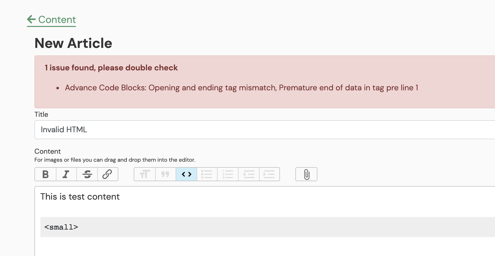

# Action Text Advanced Code Blocks Example

I work on an in house Learning Management system built in Rails. This Learning Management system allows our content team to create articles, videos and quizzes. This content is delivered through lssons for new business owners. Through these tracks they learn all they need to learn to start and run new service businesses.

Since were on rails and we needed rich text editing we reached for [Action Text](https://edgeguides.rubyonrails.org/action_text_overview.html). Action Text gives you the solid [Trix editor](https://trix-editor.org/) plug and play in your app. 

_Rails Action Text in Practice in our Content Library Back-end_

### However: Action Text / Trix doesn't support tables.

Our content team had lots of tables of information they wanted to be able to communicate. Sometimes it's hard to get across nuanced information for estimating and process without a table. We realized we needed table support in Action Text / Trix. 

### First Direction — Action Text Attachments

My first path was to extend the Action Text attachment model. This is what the [team at Timelapse documented](https://readtimelapse.com/how-we-built-table-support-for-trix-editor-cd4f14c03463). Although they provided some good direction, there was nothing I could directly leverage. Also, this seems like a lot of front end complexity for a v1 of a product. Was looking for something similar. In this research I found this great [Rails Conf video](https://www.youtube.com/watch?v=2iGBuLQ3S0c) from Chris Oliver of Go Rails, a strongly recommended resource on Action Text attachments in general. However, decided against doing something so front end heavy (for now). 

## The Crazy Idea: Render Code-blocks as HTML

Since this project didn't ever need a "Code Block" these articles render to a non-technical audience, why not allow any valid HTML written in a code block to render as HTML.

**Pros:**

- No extra front end work
- Simple Extension of the Article Decorator
- Very maintainable portable simple content (Just HTML)

**Cons:**

- Your users have to be reasonably technical to update HTML code-blocks
- You don't get a WYSIWYG interface when editing content

I put a rough prototype and did a [screen recording](https://www.loom.com/share/004c75360fe94207b00cb4f38371c753) to get my colleagues thoughts.

## Execution

All credit goes to the great [Manuel Ortega](https://dev.to/ortegacmanuel) for actually making my crazy idea work, he was able to build a clean implementation that solved many of the pitfalls my prototype was riddled with.

It all essentially boils down to one plain ol' ruby object — this `Richtext::CodeBlocks::HtmlService` object:

```ruby

class Richtext::CodeBlocks::HtmlService
  ALLOWED_HTML_TAGS = ["table", "tr", "td", "th", "col", "pre", "p", "h1", "h2", "h3", "summary", "details", "row", "code"]
  ALLOWED_HTML_ATTRIBUTES = []

  # To Validate HTML tags and protect from bad formatted input
  def self.validate(html)
    errors = []
    html = Nokogiri::HTML::DocumentFragment.parse(html)
    html.search("pre").each do |pre_tag|
      pre_tag_html, pre_tag_errors = self.ensure_well_formed_markup(pre_tag.text)
      errors.push(pre_tag_errors) unless pre_tag_errors.empty?
      inner_html = self.extract_inner_html_from_pre_tag(pre_tag_html)
      inner_html = self.remove_not_allowed_tags_and_attributes(inner_html)
      pre_tag.children.first.replace(Nokogiri::XML::Text.new(
        inner_html,
        pre_tag
      ))
    end
    html = ActionText::Fragment.new(html)
    [html.to_html, errors.flatten.uniq]
  end

  # To parse each code block tag and render it to HTML
  def self.render(rich_text)
    html = Nokogiri::HTML::DocumentFragment.parse(rich_text)
    html.search("pre").each do |pre_tag|
      inner_html = Nokogiri::HTML::DocumentFragment.parse(pre_tag.text)
      inner_html = add_styles_to_tables(inner_html)
      advanced_code_block = "<div class='advanced-code-block'>#{inner_html.to_html}</div>"
      pre_tag.replace(advanced_code_block)
    end
    html.to_html
  end

  private

  def self.ensure_well_formed_markup(html)
    parsed = Nokogiri::XML("<pre>#{html}</pre>")
    [parsed, parsed.errors]
  end

  # To add our bootstrap specific classes to table elements
  def self.add_styles_to_tables(html)
    html.search("table").each do |table|
      table["class"] = "table"
      table.wrap("<div class='table-responsive'></div>")
    end
    html
  end

  def self.extract_inner_html_from_pre_tag(html)
    Nokogiri::XML(html.at("pre").inner_html)
  end

  # To add error messages to mis-formatted HTML
  def self.error_messages(errors)
    readable_message = ->(e) { e.message.split(":")[3].strip rescue "" }
    errors.map {|e| readable_message.call(e) }.uniq.join(", ")
  end

end

```

### Using the HtmlService

You can just add a method in the article model:

```ruby
def formatted_body
  Richtext::CodeBlocks::HtmlService.render(self.body.to_s).html_safe
end

```

and then call it in the view

```erb
  <%= @article.formatted_body %>
```

### Screenshots

Here's the example of the editor with code blocks:


Here's the example output of that article:


Here's example validation being thrown to prevent you from saving bad HTML.


## In Production

Obviously this repo is a very limited example, but used well in production with an extended CSS framework this can be pretty powerful in practice:




Would love feedback / thoughts here via issues / PR's or via email

# Getting this Repo up and running

This repository has a `bin/setup` script that should get things up and running for the majority of users if you have the above dependencies installed.

From the root of the project directory - run:

`bin/setup`

Once that runs you should be able to run the following 2 commands in separate terminal tabs / windows:

1.  `rails s` - this will start the rails server on your local machine.
2.  `bin/webpack-dev-server` - this will start to watch and recompile the JavaScripts found in `app/javascript`
